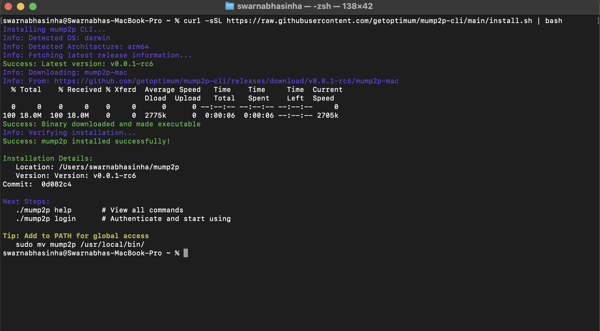

# mump2p — OptimumP2P CLI

`mump2p` is the command-line interface for interacting with [OptimumP2P](https://github.com/getoptimum/optimum-p2p) — a high-performance RLNC-enhanced pubsub protocol.

It supports authenticated publishing, subscribing, rate-limited usage tracking, and JWT session management.

---

## Features

- [x] Publish messages to topics
- [x] Subscribe to real-time message streams
- [x] gRPC support for high-performance streaming
- [x] JWT-based login/logout and token refresh
- [x] Local rate-limiting (publish count, quota, max size)
- [x] Usage statistics reporting
- [x] Persist messages to local storage
- [x] Forward messages to webhook endpoints (POST method)
- [x] Health monitoring and system metrics
  
---

## Quick Start

### 1. Installation

**Quick Install (Recommended):**
The install script automatically detects your OS (Linux/macOS), downloads the latest release binary, makes it executable, and verifies the installation.

```sh
curl -sSL https://raw.githubusercontent.com/getoptimum/mump2p-cli/main/install.sh | bash
```

**Expected Output:**


**Manual Installation:**
Download from [releases](https://github.com/getoptimum/mump2p-cli/releases/latest) and make executable.

### 2. Authentication

```sh
./mump2p login
./mump2p whoami  # Check your session
```

### 3. Basic Usage

```sh
# Subscribe to a topic (WebSocket)
./mump2p subscribe --topic=test-topic

# Subscribe via gRPC stream
./mump2p subscribe --topic=test-topic --grpc

# Publish a message (HTTP)
./mump2p publish --topic=test-topic --message='Hello World'

# Publish via gRPC
./mump2p publish --topic=test-topic --message='Hello World' --grpc
```

### Transport Protocols

- **HTTP/WebSocket (Default)**: Traditional REST API with WebSocket streaming
- **gRPC**: High-performance binary protocol with streaming support
- Use `--grpc` flag for both publishing and subscribing

---

## 📚 Documentation

- **[Complete User Guide](./docs/guide.md)** - Detailed setup, authentication, and usage instructions

---

## Version Compatibility

**Important:** Always use the latest version binaries (currently **v0.0.1-rc4**) from the releases page. 

**Current Release:**
- ✅ **v0.0.1-rc4** is the latest release

---

## FAQ - Common Issues & Troubleshooting

### **1. Authentication & Account Issues**

#### **Error: `unauthorized_client` during login**
```
Error: device code request failed: {"error":"unauthorized_client","error_description":"Unauthorized or unknown client"}
```

**Causes:**
- Incorrect Client ID in build configuration
- Auth0 application not enabled for Device Code flow
- Wrong Domain or Audience values
- Auth0 application type incorrectly configured

**Solutions:**
- Verify Auth0 application settings
- Enable Device Code grant type in Auth0
- Use correct Domain, Client ID, and Audience values

#### **Error: `your account is inactive`**
```
Error: your account is inactive, please contact support
```

**Causes:**
- User's `is_active` flag set to `false` in Auth0
- Token issued before account activation
- Missing or incorrect `app_metadata` in Auth0

**Solutions:**
- Update user's `app_metadata.is_active` to `true` in Auth0
- Logout and login again to get new token with updated claims
- Contact admin to activate your account

### **2. Build & Configuration Issues**

#### **Error: Binary not found**
```
zsh: no such file or directory: ./mump2p
```

**Causes:**
- CLI not built yet
- Wrong binary name or path
- Binary not executable

**Solutions:**
- Run `make build` with correct environment variables
- Use correct path: `./dist/mump2p-mac`
- Make binary executable: `chmod +x dist/mump2p-mac`

#### **Error: Wrong Service URL in build**

**Causes:**
- Using localhost when should use remote URL
- Using remote URL when should use localhost
- Service URL not matching actual proxy

**Solutions:**
- Rebuild with correct SERVICE_URL
- Use `--service-url` flag to override
- Match SERVICE_URL to your actual proxy endpoint

### **3. Service URL & Connectivity Issues**

#### **Available Service URLs**

By default, the CLI uses the first proxy in the list below. You can override this using the `--service-url` flag or by rebuilding with a different `SERVICE_URL`.

| **Proxy Address** | **Location** | **URL** | **Notes** |
|---------------------|--------------|---------|-----------|
| `34.146.222.111` | Tokyo | `http://34.146.222.111:8080` | **Default** |
| `35.221.118.95` | Tokyo | `http://35.221.118.95:8080` | |
| `34.142.205.26` | Singapore | `http://34.142.205.26:8080` | |

> **Note:** More geo-locations coming soon!

**Example: Using a different proxy:**

```sh
./mump2p-mac publish --topic=example-topic --message='Hello' --service-url="http://35.221.118.95:8080"
./mump2p-mac subscribe --topic=example-topic --service-url="http://34.142.205.26:8080"
```

#### **Error: Connection refused**
```
Error: HTTP publish failed: dial tcp [::1]:8080: connect: connection refused
```

**Causes:**
- Proxy not running
- Wrong port or hostname
- Firewall blocking connection
- Service not listening on specified port

**Solutions:**
- Start proxy service
- Verify correct hostname and port
- Check `docker ps` for running containers
- Use correct service URL
- Try a different proxy from the table above

### **4. Rate Limiting & Usage Issues**

#### **Error: Rate limit exceeded**
```
Error: per-hour limit reached (100/hour)
Error: daily quota exceeded
Error: message size exceeds limit
```

**Causes:**
- Publishing too frequently
- Message too large for tier
- Daily quota exhausted
- Per-second limit hit

**Solutions:**
- Wait for rate limit reset
- Use smaller messages
- Check usage: `./mump2p usage`
- Contact admin for higher limits
- Spread out publish operations

#### **Error: Token expired**
```
Error: token has expired, please login again
```

**Causes:**
- JWT token expired (24 hours)
- Clock skew
- Token corrupted

**Solutions:**
- Refresh token: `./mump2p refresh`
- Login again: `./mump2p login`
- Check system time


### **5. CLI Usage & Syntax Issues**

#### **Error: Missing required flags**
```
Error: required flag(s) "topic" not set
```

**Causes:**
- Forgetting required command line arguments
- Typos in flag names

**Solutions:**
- Use `--help` to see required flags
- Include all required arguments
- Check flag spelling and syntax

---

**Pro Tips for First-Time Users:**
- Always check `docker ps` and `docker logs` for container status
- Use `--help` flag liberally to understand command options
- Test authentication first with `whoami` before trying other operations
- Start with simple publish/subscribe before advanced features
- Keep proxy and CLI logs visible during troubleshooting
- Use [webhook.site](https://webhook.site/) for easy webhook testing
- Check `usage` command regularly to monitor limits
